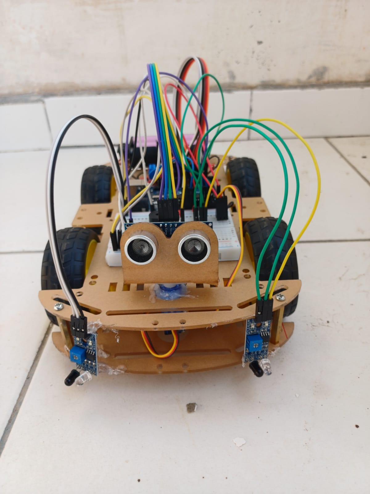
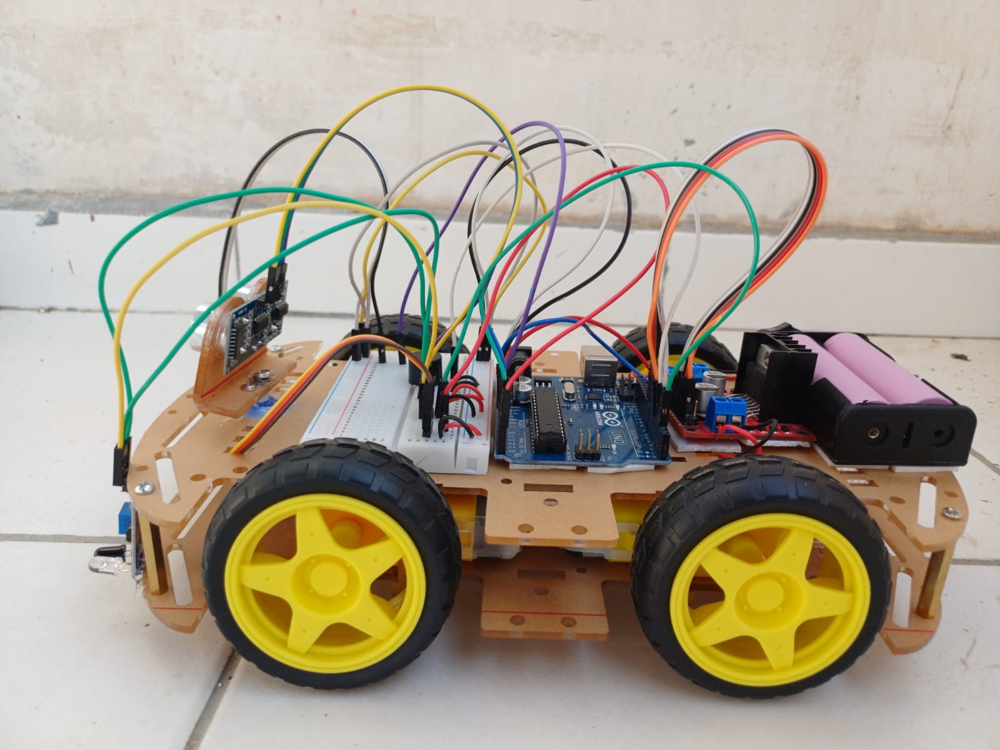
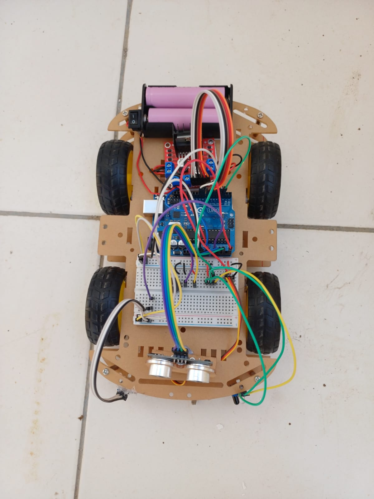

# 🤖 4WD Obstacle Avoiding Robot

An autonomous 4WD robot that detects and avoids obstacles in real-time using ultrasonic distance sensing, servo-based directional scanning, and side-mounted IR sensors — with a full startup self-test routine, buzzer-based status feedback, and onboard battery power for fully wireless operation. Built on Arduino Uno.

*Full video demo available on [LinkedIn](https://www.linkedin.com/posts/bhavy-agrawal_arduino-robotics-embeddedsystems-ugcPost-7477717047326547968-ODX4/?highlightedUpdateUrn=urn%3Ali%3Aactivity%3A7477717330442117121&origin=SOCIAL_SHARE&utm_source=share&utm_medium=member_desktop&rcm=ACoAAEm2-XYBPiEzzzSjibzbiExHBbqhMfk0aT8)*

## 🛠️ Components Used

| Component | Purpose |
|---|---|
| Arduino Uno | Main microcontroller |
| L298N Motor Driver | Controls 4 DC motors (left/right pairs) |
| 4WD Chassis | Robot base with 4 drive wheels |
| HC-SR04 Ultrasonic Sensor | Measures front distance to obstacles |
| SG90 Servo Motor | Sweeps the HC-SR04 left/right to scan surroundings |
| IR Sensors (x2) | Detect side obstacles (left & right) to prevent bumping while moving/turning |
| Buzzer | Audio feedback for startup tests, obstacle detection, and SOS alert when fully blocked |
| Power Source | 2x 18650 Li-ion battery cells (onboard, untethered) |

## 📷 Build Photos

| Front View | Side View | Top View |
|---|---|---|
|  |  |  |

## ⚡ Circuit Diagram

## 🧠 How It Works

**Startup self-test**
On power-up, the robot runs a full diagnostic sequence before operating: it tests the buzzer, sweeps the servo through right/left/center, takes sample ultrasonic readings, checks both side IR sensors, and briefly runs each motor group (left, right, forward, backward, rotate left, rotate right). This confirms every component is wired and working before autonomous mode begins, with results printed to the Serial Monitor and beeped out on the buzzer.

**Main obstacle-avoidance loop**
Once testing completes, the robot moves forward continuously while monitoring three inputs:

- **Side IR sensors** (left & right) — if either triggers, the robot immediately stops, backs up, and steers away from that side. If both trigger at once, it backs straight up before reassessing.
- **Front ultrasonic sensor (HC-SR04)** — distance is sampled multiple times per reading and averaged (with outlier trimming) for stability. If the front distance stays below a threshold for several consecutive checks (to avoid false triggers), the robot treats it as a confirmed obstacle.

**Obstacle response**
When a front obstacle is confirmed, the robot stops, backs up slightly, then sweeps the servo-mounted ultrasonic sensor first right, then left, comparing distances on each side. It rotates toward whichever side has more clearance, then re-checks the front distance — turning again if still blocked.

**Fully blocked / escape handling**
If both sides are too close to pass (truly blocked), the robot sounds an SOS pattern on the buzzer (short-long-short beeps) and retries scanning up to a few times. If no side clears, it performs a full escape maneuver — reversing and rotating 180°. A watchdog timer also tracks how long it's been since the robot last moved freely; if it's been "stuck" too long, or has bumped repeatedly in a short span, it forces this same escape routine rather than getting stuck in a retry loop.

## 🔌 How to Run

1. Open `Obstacle_avoider.ino` in the **Arduino IDE**.
2. Go to **Tools → Board** and select **Arduino Uno**.
3. Go to **Tools → Port** and select the COM port your Arduino is connected to.
4. Click **Upload**.
5. Power the Arduino via the onboard battery pack — the robot will run its startup self-test (watch the Serial Monitor for diagnostics), then begin autonomous obstacle avoidance.

---

*Built as part of ongoing robotics & embedded systems projects — CSE Undergrad.*
